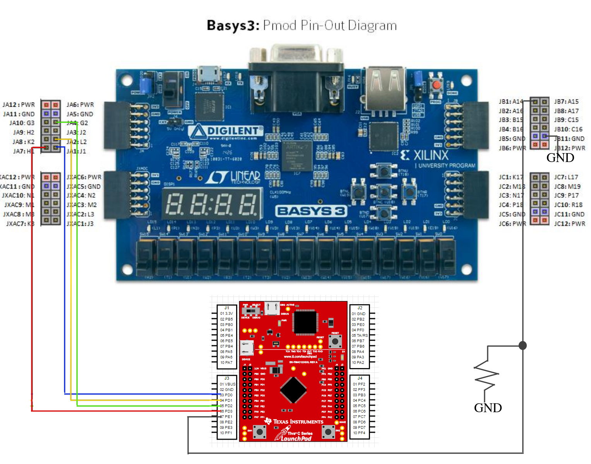

# Summary
This README file aims to explain briefly how `riscv_single_all_instr_top.sv` test works.

`riscv_single_all_instr_top.sv` is an FPGA config. whose purpose is to test a RISC-V CPU.

It executes a pre-loaded program (pre-loaded at synthesis time) which tests all the RISC-V
ilp32 ABI instructions (the complete smallest RISC-V subset of instructions). This test is
done by executing all these instructions in different scenarios and writing the results to
memory. After that, the results are sent byte-a-byte through SPI, so they can be verified
agains the expected ones in the host.

This test will require `CONFIG_ENABLE_MEM_DEFAULT_VALS` to be defined so the initial
program can be loaded at synthesis time.

`riscv_single_all_instr_top_tb.sv` will perform a simulation of the FPGA program. See the
`Makefile` file to check the required definitions, include directories, module dependencies
etc.

To execute the simulation execute `make all`. This will generate wavedumps as well. Some
tests might take a few seconds to perform, but not too many.

**Note:** Inspect the `Makefile` to see how to configure a Vivado project. `cnstr` contains
the required constrains file for the project.

# How to execute these tests in the physical FPGA
**Note:** This test requires to read from an SPI port, therefore a device
capable of this must act as a bridge between the FPGA and the host. You can
user `find_spi_iface.sh` to try find this SPI interface by providing a keyword.

Connect to the FPGA a device capable of reading SPI as following:

Configure the SPI reader as:
- PHA = 0
- POL = 1
- Num. bits = 8
- Min. bit rate: 10 kHz

**Note:** the min. bit rate is currently 10 kHz but depends on the bit rate of
the master SPI in the FPGA, so double check it.

In the host computer, open the SPI reader interface, possibly dumping its results
to a file. E.g.:

    minicom -D /dev/ttyACM0 -C riscv-fpga-test-res.txt

Flash the FPGA wasn't already, or reset it if it was. You should see a bunch of bytes
in the terminal opened above.

Copy all of them to a file. This won't be necessary if they were dumped already by
doing something equivalent to the `minicom` example above. Make sure this file contains
only bytes ontained, one in each line, and **nothing** else (no text, no empty lines etc.)

Execute:

        verif_results.py riscv-fpga-test-res.txt

If the above returns nothing, everything is file. Errors will be reported as assertion errors.

**Note:** The above file checks the obtained values agains `expected_results.py`
